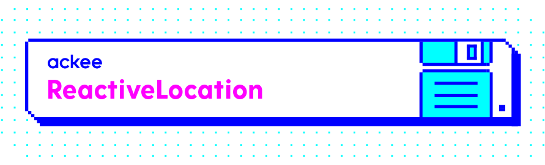

[](http://cocoapods.org/pods/ReactiveLocation)
[](http://cocoapods.org/pods/ReactiveLocation)
[](http://cocoapods.org/pods/ReactiveLocation)

## ReactiveSwift wrapper to observe location

Our wrapper automatically asks for permission. It determines what kind of permission your app requires by checking the Info.plist of your app.

By using our wrapper you can use a single instance of `CLLocationManager` and it will automatically start and stop updating location based on the number of observers so your app doesn't drain device battery unnecessarily.

## Example usage

For example usage you can check our example that is part of this repository. 

For simplest cases you are provided a `shared` instance:

```swift
ReactiveLocation.shared.locationProducer().startWithValues { location in
    print(location)
}
```

If you need more different setups for your `CLLocationManager` you can create additional instances simply by creating new instances of `ReactiveLocation` and adding your desired setup to the `locationManager` which is provided to you (but it's up to you to make sure that the instance is alive as long as you need it):

```swift
let reactiveLocation = ReactiveLocation()
reactiveLocation.locationManager.distanceFilter = 100 // do your custom setup
reactiveLocation.locationProducer().startWithValues {
    print($0)
}
// store `reactiveLocation` instance somewhere
```

## Testing support

All features of `ReactiveLocation` are wrapped into `ReactiveLocationService` protocol so you should use this protocol as dependency inside your project so you're able to inject any testing implementation you like.

## Installation

`ReactiveLocation` is available through Carthage so adding it to your Cartfile works just fine.

```ruby
github "AckeeCZ/ReactiveLocation"
```

If you're not familiar with Carthage, we also support Cocoapods.

```ruby
pod "ReactiveLocation"
```

Well if you're not familiar with any dependency manager, you're free to integrate it manually. 😎 But keep in mind that we depend on `ReactiveSwift`.

## Forking this repository
If you use ReactiveLocation in your projects drop us a tweet at [@ackeecz][1] or leave a star here on Github. We would love to hear about it!

## Sharing is caring
This tool and repo has been opensourced within our `#sharingiscaring` action when we have decided to opensource our internal projects

## Author

[Ackee](www.ackee.cz) team

## License

ReactiveLocation is available under the MIT license. See the LICENSE file for more info.

[1]:	https://twitter.com/AckeeCZ
